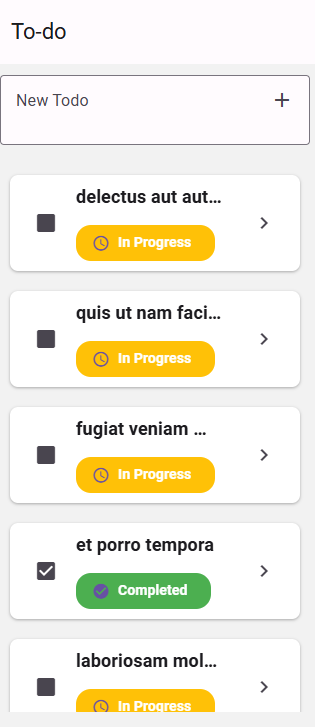

# Shamz Todo App

Shamz Todo App is a simple and intuitive task management application built with React Native and Expo. It helps users to keep track of their daily tasks and manage their time efficiently.



## Features

- Add, edit, and delete tasks
- Mark tasks as completed
- View tasks in a list
- Responsive design for both mobile and web

## Installation

- [Download The Android APK](https://expo.dev/artifacts/eas/fDABk96EAZv9VdMQJeLBrJ.apk)
- [/shamz-todo.apk](/shamz-todo.apk)

OR 

[View The Web Version](https://shamz-todo.vercel.app/)

1. Clone the repository:

   ```sh
   git clone https://github.com/mgregchi/shamz-todo.git
   cd shamz-todo
   ```

2. Install the dependencies:

   ```sh
   npx expo install
   ```

## Usage

To start the application, use one of the following commands:

- Start the development server (Expo):

  ```sh
  npm start
  ```

  Or you can use:

  ```sh
  expo start
  ```

  This command will open the Expo DevTools in your browser and give you a QR code to scan with the Expo Go app.

- Start the application on an Android device or emulator:

  ```sh
  npm run android
  ```

  Or:

  ```sh
  expo start --android
  ```

- Start the application on an iOS device or simulator:

  ```sh
  npm run ios
  ```

  Or:

  ```sh
  expo start --ios
  ```

- Start the application on the web:

  ```sh
  npm run web
  ```

  Or:

  ```sh
  expo start --web
  ```

## Project Structure

```
.gitignore
app/
	app.json
	App.jsx
	assets/
        favicon.png
        icon.png
        splash.jpg
        adaptive-icon.png
	package.json
	src/
		components/
			TodoItem.jsx
		contexts/
			LoadingContext.jsx
			MessageContext.jsx
		screens/
			__delete.LandingScreen.jsx
			DetailScreen.jsx
			ListScreen.jsx
		services/
			api.js
		styles/
			index.js
LICENSE
```

## Dependencies

- `@react-navigation/native`: ^6.1.7
- `@react-navigation/native-stack`: ^6.10.8
- `@tanstack/react-query`: ^4.29.12
- `axios`: ^1.5.1
- `expo`: ~49.0.8
- `expo-status-bar`: ~1.6.0
- `react`: 18.2.0
- `react-dom`: 18.2.0
- `react-native`: 0.72.10
- `react-native-gesture-handler`: ~2.12.0
- `react-native-paper`: ^5.13.1
- `react-native-reanimated`: ~3.3.0
- `react-native-safe-area-context`: 4.6.3
- `react-native-screens`: ~3.22.0
- `react-native-toast-message`: ^2.2.1
- `react-native-web`: ~0.19.10

## Dev Dependencies

- `@babel/core`: ^7.20.0
- `@expo/metro-runtime`: ~3.1.3
- `@expo/webpack-config`: ^19.0.1
- `expo-build-properties`: ~0.8.3
- `metro-react-native-babel-preset`: 0.77.0
- `metro-react-native-babel-transformer`: 0.77.0

## License

This project is licensed under the MIT License. See the 

LICENSE

[LICENCE](/LICENSE)

[Mgregchi](https://mgregchi.github.io)

